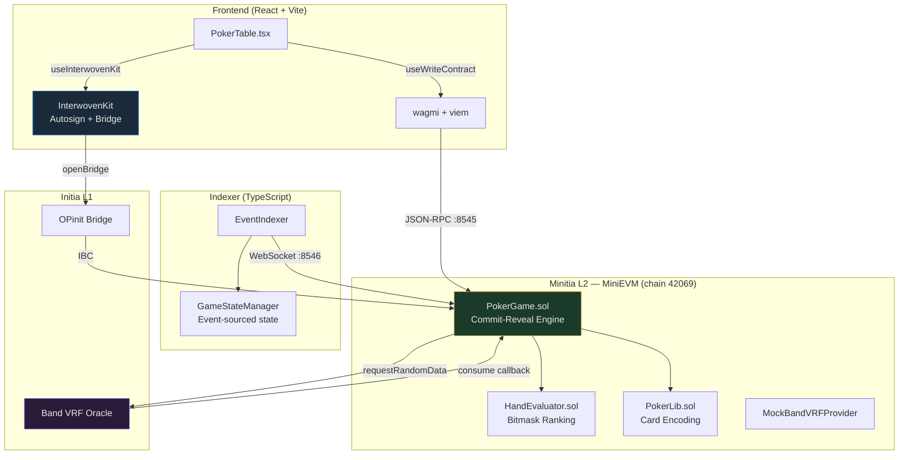

<p align="center">
  <b>♠ ♥ ♦ ♣</b><br/>
  <h1 align="center">INIPoker</h1>
  <p align="center">
    Trustless on-chain Texas Hold'em on Initia — where the blockchain is the dealer.
  </p>
  <p align="center">
    <a href="https://initia.xyz">Initia</a> ·
    <a href="https://docs.initia.xyz/interwovenkit/introduction">InterwovenKit</a> ·
    <a href="https://bandprotocol.com/vrf">Band VRF</a> ·
    <b>INITIATE Hackathon 2026</b> — Gaming & Consumer Track
  </p>
</p>

---

## What is INIPoker?

INIPoker is a fully on-chain, privacy-preserving Texas Hold'em poker engine built natively on Initia's Minitia L2 rollup (MiniEVM runtime). It was ported from the open-source Go P2P poker engine [anthdm/ggpoker](https://github.com/anthdm/ggpoker) and completely reimagined for the blockchain — eliminating the need for trusted servers, centralized card shuffling, or direct peer-to-peer networking.

Every card shuffle uses **Band VRF** for cryptographic randomness. Every hole card is hidden behind a **commit-reveal scheme** — the deck never exists in storage. Every player action signs instantly through **InterwovenKit Autosign** — no wallet popups during gameplay. The blockchain consensus layer replaces the original TCP gossip protocol entirely.

## Why does this matter?

Online poker has a fundamental trust problem. Centralized platforms control the deck, the random number generator, and the pot. Players must trust that the house isn't cheating. There is no way to verify.

INIPoker solves this by making every aspect of the game publicly verifiable:

| Problem | Centralized Poker | INIPoker |
|---|---|---|
| Card shuffling | Server-side RNG (opaque) | **Band VRF** — proof published on-chain |
| Hole card privacy | Server knows all cards | **Commit-reveal** — deck exists only in EVM memory during one tx |
| Pot custody | Platform holds funds | **Smart contract escrow** — trustless, automatic payout |
| Game fairness | "Trust us" | **76 Foundry tests** — mathematically verified |
| Action speed | Instant (centralized) | **Autosign** — equally instant, but decentralized |

## Who is it for?

- **Players** who want provably fair poker without trusting a platform
- **Developers** building real-time games on Initia's Interwoven Stack
- **The Initia ecosystem** as a reference implementation for gaming on MiniEVM

## How it works

### Architecture



### How Initia's consensus replaces Go's P2P layer

The original `ggpoker` engine used a TCP mesh network with Gob encoding and `sync.RWMutex` for state synchronization. Every node maintained its own copy of the game state and broadcast changes via channels. This architecture has no consensus — if two nodes disagree, there's no resolution.

INIPoker eliminates the entire P2P layer. The Minitia L2 blockchain **is** the communication layer:

| Original Go (removed) | Initia replacement |
|---|---|
| `p2p.Server` + TCP sockets | Minitia L2 JSON-RPC endpoint |
| `p2p.Broadcast()` via channels | Solidity events (`PlayerActed`, `StatusChanged`, ...) |
| `encoding/gob` serialization | ABI encoding (handled by viem) |
| `sync.RWMutex` concurrency | Atomic EVM execution (no mutex needed) |
| `p2p.GameState` mutable struct | `GameStateManager.ts` — event-sourced from on-chain logs |
| `p2p.Handshake` message | `PlayerJoined` event |
| `p2p.MessageEncDeck` | `HoleCardsCommitted` event (hash only — no plaintext) |
| Peer discovery (`Connect()`) | Not needed — blockchain is the shared bus |
| No finality guarantee | `confirmationDepth` blocks before state is trusted |

### Commit-Reveal card dealing (privacy)

The deck **never** exists in EVM storage. This is the critical difference from naive implementations:

```
Phase 0: Player generates random salt off-chain
         → calls commitSalt(keccak256(salt))
         → only the hash is stored

Phase 1: requestDeal() fires Band VRF request

Phase 2: consume() callback runs Fisher-Yates IN MEMORY:
         deckSeed = keccak256(vrfResult, saltHash₀, saltHash₁, ...)
         uint8[52] memory deck = _fisherYatesMemory(deckSeed)
         → deck is discarded when the function returns
         → only keccak256(card0, card1, saltHash) commitments are stored

Phase 3: Betting rounds proceed normally (PreFlop → River)

Phase 4: revealHoleCards(salt) at showdown:
         → verify keccak256(salt) == stored saltHash
         → re-derive deck from deckSeed in memory
         → verify keccak256(card0, card1, saltHash) == stored commitment
         → only THEN are cards revealed (betting is already over)

Phase 5: evaluateShowdown() uses bitmask HandEvaluator
         → ~60,000 gas for 7-card evaluation
```

---

## Sponsor Integrations

### 1. Initia — OPinit Stack (Minitia L2 Rollup)

INIPoker runs on a dedicated MiniEVM rollup configured in [`config/config.yaml`](config/config.yaml):

```yaml
runtime: evm
chain_id: "ggpoker-minitia-1"
gas_token:
  denom: "GAS"
  decimals: 18
evm:
  chain_id: 42069
  block_gas_limit: 30000000
bridge:
  submission_interval: "1h"
  finalization_period: "604800s"
```

The OPinit bridge bots (Executor and Challenger) are configured in [`keys/`](keys/), enabling trustless L1↔L2 asset transfers. The rollup is purpose-built for poker: low-latency blocks, EVM compatibility, and native Initia bridge integration.

**Why a dedicated rollup?** Poker requires fast block times for responsive gameplay, deterministic gas costs for budgeting player actions, and isolation from other dApps that could cause congestion. Minitia gives us a sovereign execution environment with L1 settlement guarantees.

### 2. InterwovenKit — Autosign for Seamless Gaming UX

The fundamental UX challenge: traditional Web3 poker requires a wallet popup for every Fold, Call, and Raise. This destroys the pace of play.

INIPoker uses InterwovenKit's Autosign feature to create a **ghost wallet** (session key) that auto-signs whitelisted transaction types. The player approves once at the start of a session, and all poker actions fire instantly with zero popups.

**Provider configuration** ([`frontend/src/providers.tsx`](frontend/src/providers.tsx)):

```tsx
import {
  initiaPrivyWalletConnector,
  injectStyles,
  InterwovenKitProvider,
  TESTNET,
} from '@initia/interwovenkit-react'
import interwovenKitStyles from '@initia/interwovenkit-react/styles.js'

// Autosign: /minievm.evm.v1.MsgCall covers ALL PokerGame.sol functions
// We intentionally exclude /cosmos.bank.v1beta1.MsgSend
// so direct token transfers still require manual approval
const AUTOSIGN_PERMISSIONS = {
  [COSMOS_CHAIN_ID]: ['/minievm.evm.v1.MsgCall'],
}

export default function Providers({ children }) {
  useEffect(() => { injectStyles(interwovenKitStyles) }, [])

  return (
    <QueryClientProvider client={queryClient}>
      <WagmiProvider config={wagmiConfig}>
        <InterwovenKitProvider
          {...TESTNET}
          defaultChainId={COSMOS_CHAIN_ID}
          enableAutoSign={AUTOSIGN_PERMISSIONS}
        >
          {children}
        </InterwovenKitProvider>
      </WagmiProvider>
    </QueryClientProvider>
  )
}
```

**In-game usage** ([`frontend/src/components/PokerTable.tsx`](frontend/src/components/PokerTable.tsx)):

```tsx
const { openConnect, openWallet, openBridge, autoSign } = useInterwovenKit()

// One-time session approval — creates ghost wallet
const startSession = async () => await autoSign.enable()

// All poker actions now fire instantly — zero popups
const fold  = () => writeContractAsync({ functionName: 'playerAction', args: [tableId, 1, 0n] })
const call  = () => writeContractAsync({ functionName: 'playerAction', args: [tableId, 4, 0n] })
const raise = () => writeContractAsync({ functionName: 'playerAction', args: [tableId, 5, amt] })

// Bridge: fund L2 wallet from Initia L1 with one click
<button onClick={() => openBridge({
  srcChainId: 'interwoven-1', srcDenom: 'uinit',
  dstChainId: 'ggpoker-minitia-1', dstDenom: 'ugas',
})}>
  Fund Wallet
</button>
```

### 3. Band VRF — Provably Fair Card Shuffling

The original Go engine used `math/rand.Shuffle()` — a pseudorandom function that is trivially predictable in a deterministic blockchain environment. INIPoker replaces it with Band Protocol VRF, which produces cryptographically verifiable randomness.

**VRF request flow** ([`contracts/src/PokerGame.sol`](contracts/src/PokerGame.sol)):

```solidity
function requestDeal(uint256 tableId) external {
    // ... validation ...
    string memory seed = string(abi.encodePacked(
        "POKER:", _uint2str(tableId), ":", _uint2str(s.handId)
    ));
    IBandVRFProvider(vrfProvider).requestRandomData(seed);
}
```

**VRF callback with Fisher-Yates** — the core security boundary:

```solidity
function consume(string calldata seed, uint64 time, bytes32 result) external override {
    // CRITICAL: only Band VRF Provider can call this
    if (msg.sender != vrfProvider) revert OnlyVRFProvider(vrfProvider, msg.sender);

    // Combine VRF result with ALL player salt commitments
    bytes32 deckSeed = keccak256(abi.encodePacked(result, saltHash0, saltHash1, ...));

    // Fisher-Yates runs IN MEMORY — deck never touches storage
    uint8[52] memory deck = _fisherYatesMemory(deckSeed);

    // Store ONLY cryptographic commitments (not cards)
    for (uint8 i = 0; i < playerCount; i++) {
        p.holeCommitment = keccak256(abi.encodePacked(card0, card1, p.saltHash));
    }
    // `deck` memory array is DISCARDED when this function returns
}
```

**Gas-optimized hand evaluation** ([`contracts/libraries/HandEvaluator.sol`](contracts/libraries/HandEvaluator.sol)):

Hand ranking uses 64-bit bitmasks instead of nested loops. Each suit gets a 13-bit value mask; straight detection is a single 5-bit pattern shift. Population count uses Kernighan's algorithm. All 10 poker hand ranks are encoded in a single `uint32` where `rank_a > rank_b` determines the winner directly. Total cost: ~60,000 gas for 7-card evaluation.

---

## Project Structure

```
├── contracts/                     Solidity smart contracts
│   ├── src/
│   │   ├── PokerGame.sol          Core engine: commit-reveal + VRF + state machine
│   │   └── MockBandVRFProvider.sol Devnet VRF mock (auto-fulfill mode)
│   ├── interfaces/
│   │   ├── IVRFConsumer.sol       Band VRF callback interface
│   │   └── IBandVRFProvider.sol   Band VRF request interface
│   ├── libraries/
│   │   ├── PokerLib.sol           Card encoding, enums, game structs
│   │   └── HandEvaluator.sol      Bitmask-based hand ranking
│   └── test/
│       ├── PokerGame.t.sol        53 integration tests
│       └── HandEvaluator.t.sol    23 unit tests (all 10 hand ranks)
├── frontend/                      React + Vite + InterwovenKit
│   └── src/
│       ├── providers.tsx          InterwovenKitProvider + Autosign + wagmi
│       ├── components/
│       │   └── PokerTable.tsx     Game UI: seats, cards, actions, bridge
│       └── config/
│           ├── chain.ts           MiniEVM chain definition (from MINITIA_ENV.md)
│           └── contract.ts        PokerGame ABI: 6 events, 5 views, 7 writes
├── indexer/                       Event-sourced state (replaces Go p2p/)
│   └── src/
│       ├── core/
│       │   ├── EventIndexer.ts    WebSocket subscriptions (replaces TCP mesh)
│       │   └── GameStateManager.ts Event replay + reorg safety
│       └── types/
│           ├── abi.ts             Contract event ABI
│           └── game.ts            TypeScript game state types
├── config/config.yaml             Minitia rollup configuration
├── script/DeployPokerGame.s.sol   Foundry deployment script
├── deploy.sh                      Build → test → deploy automation
├── MINITIA_ENV.md                 Endpoints + contract addresses
└── foundry.toml                   Foundry compiler configuration
```

## Quick Start

```bash
# 1. Clone
git clone https://github.com/henessay/INIPoker.git
cd INIPoker

# 2. Install Foundry & dependencies
curl -L https://foundry.paradigm.xyz | bash && foundryup
forge install foundry-rs/forge-std --no-commit

# 3. Run 76 tests
forge test -vvv --gas-report

# 4. Deploy to local Minitia L2 (requires weave CLI)
./deploy.sh all

# 5. Start frontend
cd frontend && npm install && npm run dev

# 6. Start event indexer
cd indexer && npm install && npm run dev
```

## Test Results

**76 tests** across 2 test contracts covering all critical paths:

| Category | Tests | What's verified |
|---|---|---|
| Table management | 12 | Create, join, leave, buy-in bounds |
| Salt commitment | 5 | Phase 0 commit, double-commit, zero hash |
| VRF integration | 7 | Request, callback security, deck commitment |
| Commit-reveal | 4 | Hole card commitments, no plaintext leakage |
| Betting actions | 8 | All 6 action types + turn/phase enforcement |
| Timeout | 3 | Auto-fold, deadline check, settlement |
| Full lifecycle | 4 | Deal → bet → settle → next hand on same table |
| Reveal edge cases | 3 | Wrong salt, early reveal, inactive player |
| Settlement | 3 | Last standing, evaluate routing, not-revealed guard |
| Gas benchmarks | 4 | createTable, join, deal+VRF, fold |
| Hand evaluation | 23 | All 10 ranks, tiebreakers, board-plays split pot |

## Tech Stack

| Layer | Technology | Purpose |
|---|---|---|
| L1 | Initia (interwoven-1) | Settlement + bridge |
| L2 | Minitia MiniEVM | Game execution |
| Contracts | Solidity ^0.8.20 | Poker engine |
| VRF | Band Protocol | Provable randomness |
| Frontend | React + Vite | Game UI |
| Wallet | InterwovenKit + wagmi | Autosign + bridge |
| Indexer | TypeScript + viem | Event-sourced state |
| Testing | Foundry | 76 tests, gas reports |

## Security Considerations

- **Deck privacy**: The shuffled deck array uses the `memory` keyword and is discarded when `consume()` returns. `eth_getStorageAt()` cannot read it.
- **VRF caller check**: `consume()` reverts if `msg.sender != vrfProvider`. Without this check, anyone could inject fake randomness.
- **Salt binding**: The `deckSeed` incorporates every player's salt hash, preventing the VRF provider from biasing the shuffle.
- **Autosign scope**: The ghost wallet is limited to `/minievm.evm.v1.MsgCall` — it can call contract functions but cannot send direct token transfers.

## License

MIT

---

<p align="center">
  Built for <b>INITIATE Hackathon 2026</b> by <a href="https://github.com/henessay">henessay</a><br/>
  Powered by <b>Initia</b> · <b>InterwovenKit</b> · <b>Band VRF</b>
</p>
